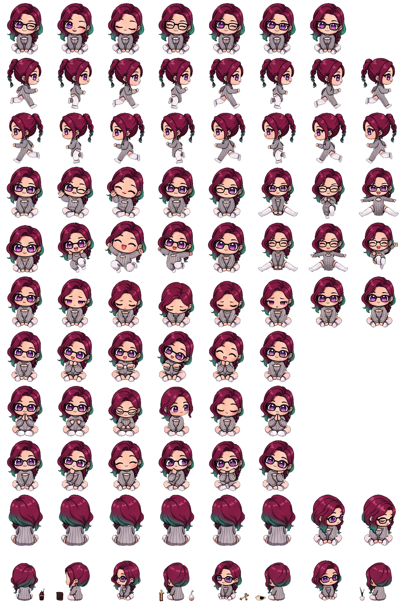

# 🐾 WebJarvis Pet Addon (OpenPets Mini Core)

[🇩🇪 Zur deutschen Dokumentation wechseln](README_DE.md) | [🇬🇧 Switch to English Documentation](README.md)

An interactive, animated companion addon for **WebJarvis** inspired by **OpenPets**, featuring native spritesheet rendering, OpenPets V2 gaze tracking, autonomous roaming, and live WebSocket telemetry reactions.



---

## ✨ Features

- **🎮 OpenPets V2 Compatibility**: Native support for 8×11 sprite atlases (192×208 frame dimension) matching OpenPets Codex V2 specifications.
- **👁️ Cursor Gaze Tracking**: 16-sector dynamic eye and head tracking (Rows 9 & 10) that follows the user's cursor across the viewport.
- **🚶 Autonomous Roaming**: Realistic wandering mechanics with boundary collision detection, directional switching, and natural pauses.
- **🔄 Live J.A.R.V.I.S. Telemetry**:
  - `THINKING` ➜ Reviews & analyzes (Row 8).
  - `SPEAKING` ➜ Waves & delivers speech bubbles (Row 3).
  - `LISTENING` / `CONFIRM` ➜ Waiting animation (Row 6).
  - `ERROR` ➜ Expresses concern (Row 5).
  - `IDLE` ➜ Relaxed blinking and neutral pose (Row 0).
- **💬 Interactive Speech Bubbles**: Displays real-time Jarvis answers and companion dialogues.
- **🖱️ Drag & Drop**: Freely repositionable anywhere on the screen with mouse grip physics.
- **💖 Tactile Feedback**: Click to pet or celebrate (`jumping`), hover purring, and Web Audio API synthesized sound effects.
- **⚙️ Integrated HUD Flyout**: Toggle roaming, cursor gaze, sound effects, dialogues, and scale (40% - 120%).

---

## 📦 Directory Structure

```text
webjarvis_petaddon/
├── components/
│   └── JarvisPet.tsx          # React Canvas & HUD Companion Component
├── lib/
│   ├── petEngine.ts           # OpenPets V2 state machine, gaze math & WebAudio FX
│   └── petTypes.ts            # Type definitions & animation metadata
├── pets/
│   └── yuyu-chibi/
│       ├── pet.json           # Pet manifest & configuration
│       └── spritesheet.webp   # 1536x2288 OpenPets V2 Sprite Atlas
├── install.sh                 # 1-Click integration script for WebJarvis
├── uninstall.sh               # Safe rollback uninstaller
├── posting.md                 # Community & Social Media Showcase Postings
├── posting-win.md             # Windows / Cross-Platform Posting Format
├── README.md                  # English Documentation
└── README_DE.md               # German Documentation
```

---

## 🚀 Quick Start & Installation

To install the Pet Addon into your WebJarvis instance:

```bash
cd /home/graba/Schreibtisch/ASGRAD/Valhalla/TOOLS/GRABAS_GITHUB/webjarvis_petaddon
chmod +x install.sh
./install.sh
```

Or specify a custom WebJarvis path:
```bash
./install.sh /path/to/webjarvis
```

Once installed, start WebJarvis and click the **🐾 Cat Icon** in the bottom dock to summon Yuyu!

---

## 📄 License

MIT License. Designed & engineered for the Valhalla Suite.
